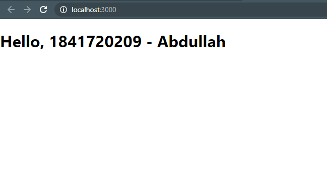
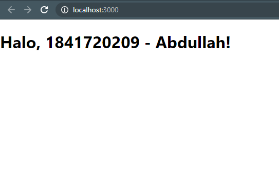
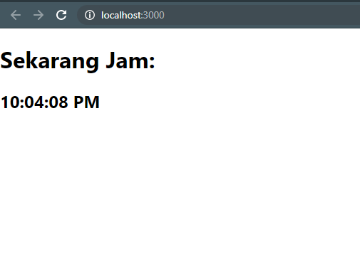
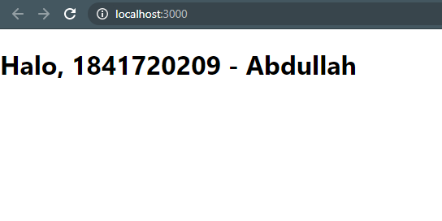
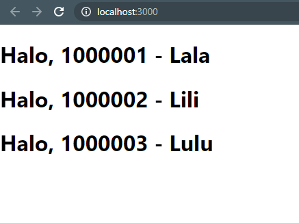
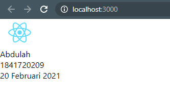
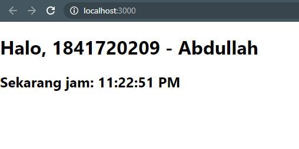

# 03 - Konsep ReactJS

## Tujuan Pembelajaran

1. Pengenalan tentang JSX (JavaScript XML)
2. Rendering elements
3. Penggunaan component dan props
4. State dan lifecycle
5. Menangani events (Codelab berikutnya)
6. Conditional rendering (Codelab berikutnya)
7. Penggunaan Lists dan Keys (Codelab berikutnya)
8. Penggunaan Forms (Codelab berikutnya)

## Hasil Praktikum

## Praktikum 1

    

    
Untuk melihat kode langsung klik tautan berikut [Link Kode](../../src/03_Konsep_ReactJS/Praktikum_1/src_1/index.js)

## Praktikum 2

Untuk melihat kode langsung klik tautan berikut [Link Kode](../../src/03_Konsep_ReactJS/Praktikum_2/index.js)

## Praktikum 3

Untuk melihat kode langsung klik tautan berikut [Link Kode](../../src/03_Konsep_ReactJS/Praktikum_3/index.js)

## Praktikum 4

Untuk melihat kode langsung klik tautan berikut [Link Kode Index](../../src/03_Konsep_ReactJS/Praktikum_4/index.js) & [Link Kode App](../../src/03_Konsep_ReactJS/Praktikum_4/App.js) 

## Praktikum 5

Untuk melihat kode langsung klik tautan berikut [Link Kode Index](../../src/03_Konsep_ReactJS/Praktikum_5/index.js) & [Link Kode App](../../src/03_Konsep_ReactJS/Praktikum_5/App.js) 

## Praktikum 6

Untuk melihat kode langsung klik tautan berikut [Link Kode](../../src/03_Konsep_ReactJS/Praktikum_6/index.js)
