# 04 - Konsep ReactJS Bagian 2

## Tujuan Pembelajaran

1. Pengenalan tentang JSX (JavaScript XML) (Codelab sebelumnya)
2. Rendering elements (Codelab sebelumnya)
3. Penggunaan component dan props (Codelab sebelumnya)
4. State dan lifecycle (Codelab sebelumnya)
5. Menangani events
6. Conditional rendering
7. Penggunaan Lists dan Keys
8. Penggunaan Forms

## Hasil Praktikum

## Praktikum 1: Menangani events pada toggle button

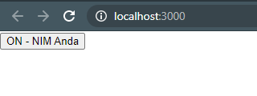
    
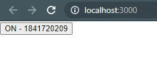
    
Untuk melihat kode langsung klik tautan berikut [Link Kode 1](../../src/04_Konsep_ReactJS_2/Praktikum_1/index-cara1.js) [Link Kode 2](../../src/04_Konsep_ReactJS_2/Praktikum_1/index-cara2.js) [Link Kode 3](../../src/04_Konsep_ReactJS_2/Praktikum_1/index-cara3.js)

## Praktikum 2: Rendering login secara kondisional

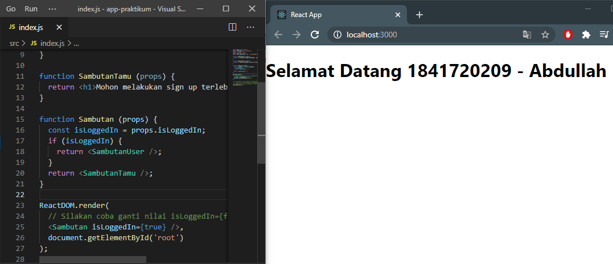

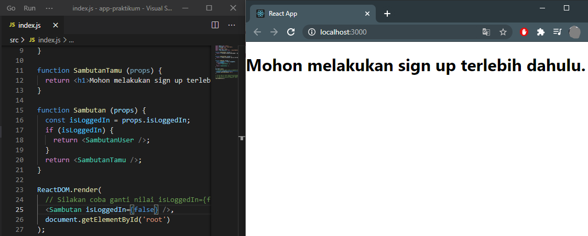

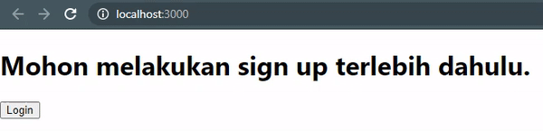

Untuk melihat kode langsung klik tautan berikut [Link Kode](../src/04_Konsep_ReactJS_2/Praktikum_2/index-cara2.1.js)

## Praktikum 3: Menyimpan elements dengan variabel

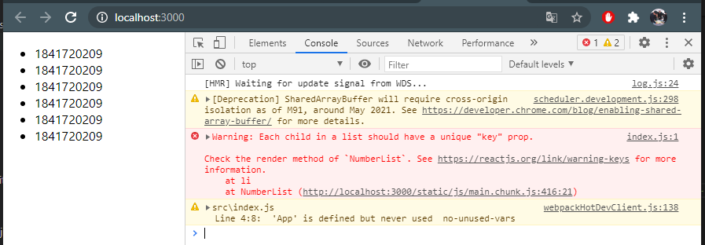

Untuk melihat kode langsung klik tautan berikut [Link Kode](../src/04_Konsep_ReactJS_2/Praktikum_3/index.js)

## Praktikum 4: Komponen list dasar

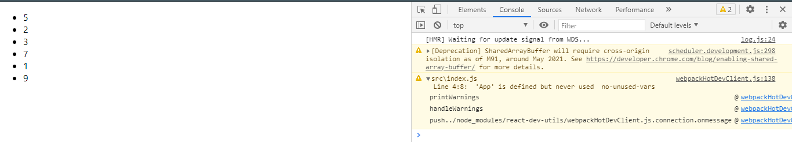

Untuk melihat kode langsung klik tautan berikut [Link Kode](../src/04_Konsep_ReactJS_2/Praktikum_4/index.js)

## Praktikum 5: Membuat unique keys

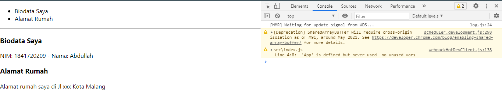

Untuk melihat kode langsung klik tautan berikut [Link Kode](../src/04_Konsep_ReactJS_2/Praktikum_5/index.js)

## Praktikum 6: Membuat form dengan controlled components

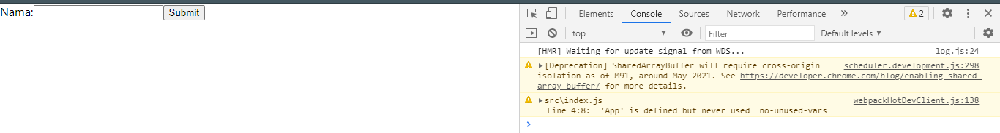

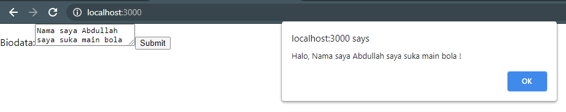

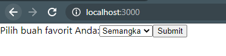

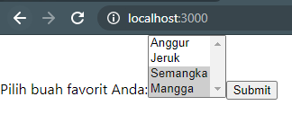

Untuk melihat kode langsung klik tautan berikut [Link Kode 1](../src/04_Konsep_ReactJS_2/Praktikum_6/index-form.js) [Link Kode 2](../src/04_Konsep_ReactJS_2/Praktikum_6/index-multiple-select.js) [Link Kode 3](../src/04_Konsep_ReactJS_2/Praktikum_6/index-select.js) [Link Kode 4](../src/04_Konsep_ReactJS_2/Praktikum_6/index-textarea.js) 

