# 05 - API dan React Router di ReactJS

## Tujuan Pembelajaran

1. Mengambil data dari API
2. Membuat routing di ReactJS

## Hasil Praktikum

## Praktikum 1

    
Untuk melihat kode langsung klik tautan berikut [Link Kode](../../src/05_API_dan_Router_ReactJS/Praktikum_1/index.js)

## Praktikum 2

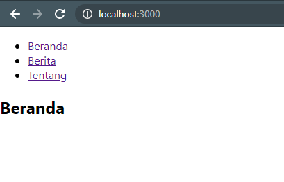

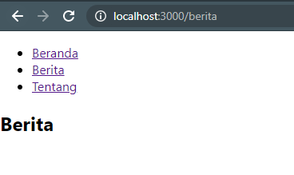

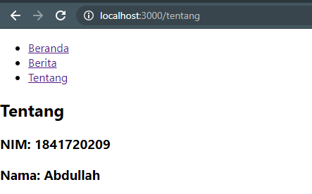

Untuk melihat kode langsung klik tautan berikut [Link Index](../../src/05_API_dan_Router_ReactJS/Praktikum_2/index.js) & [Link App](../../src/05_API_dan_Router_ReactJS/Praktikum_2/App.js)

## Praktikum 3

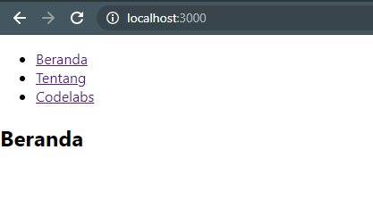

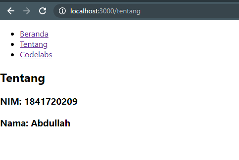

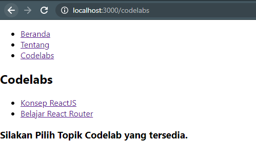

Untuk melihat kode langsung klik tautan berikut [Link App](../../src/05_API_dan_Router_ReactJS/Praktikum_3/App.js)

## Tugas

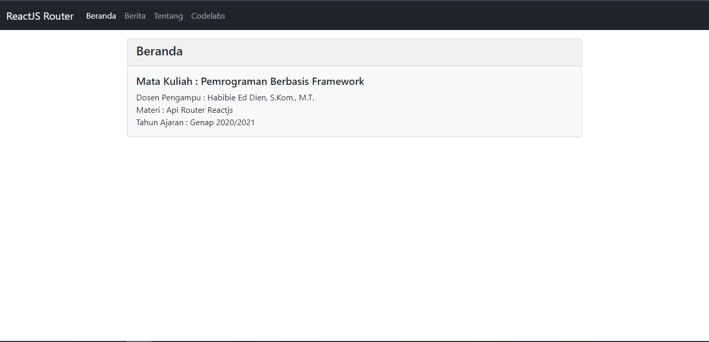

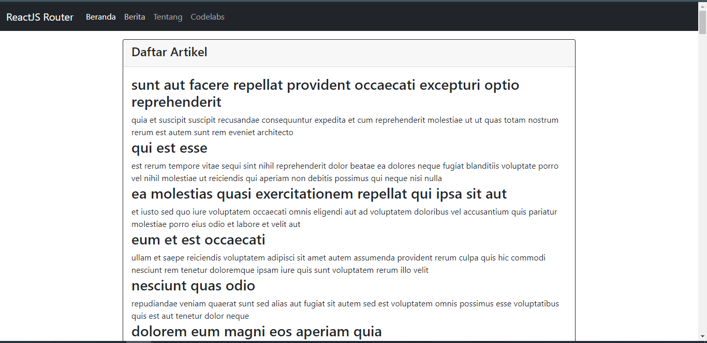

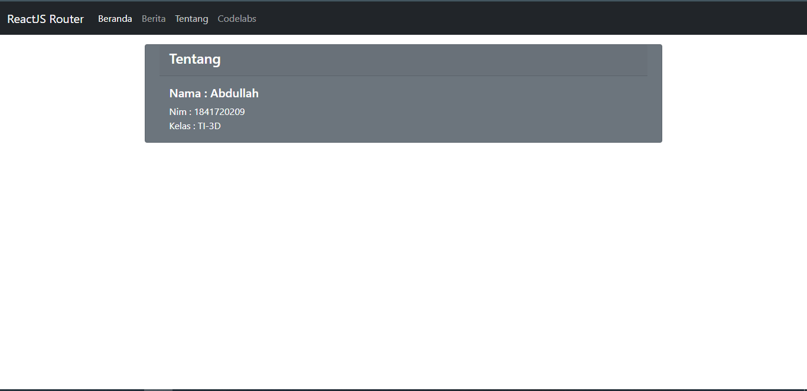

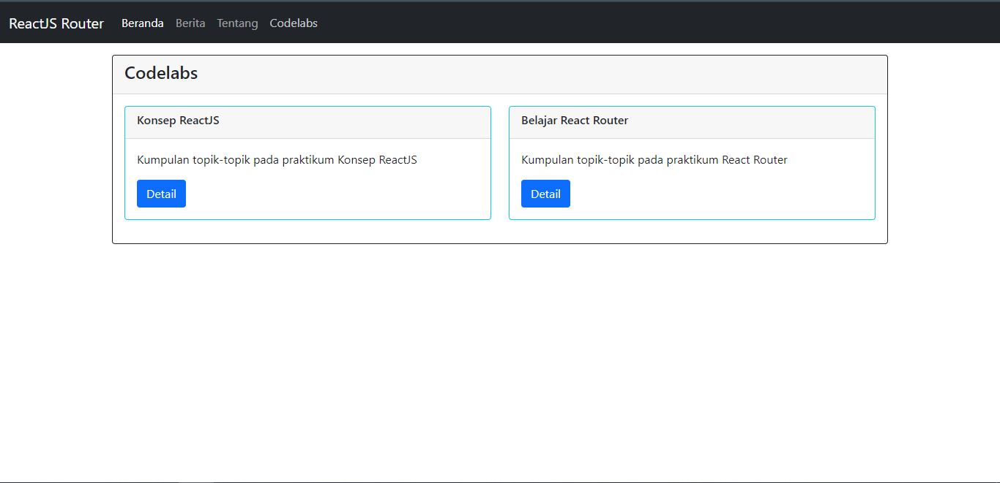

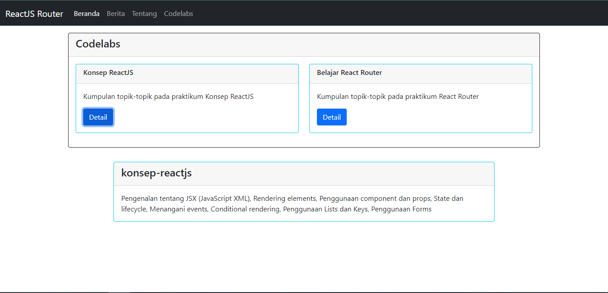

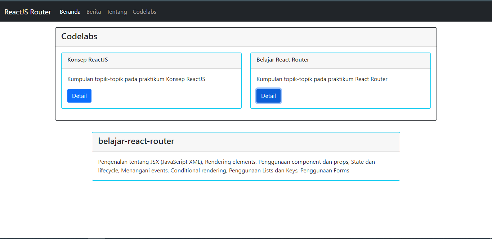

Untuk melihat kode langsung klik tautan berikut [Link App](../../src/05_API_dan_Router_ReactJS/Praktikum_4/App.js)

