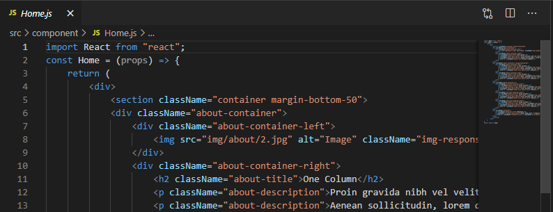
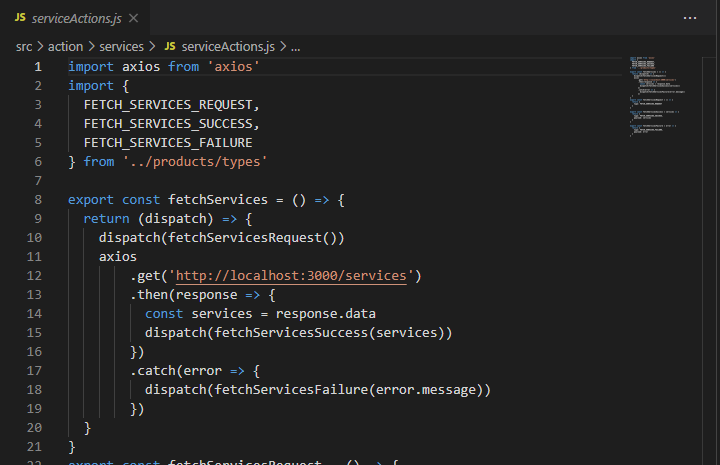

# 08 - Ujian Tengah Semester

## Tujuan Pembelajaran
Menguji kemampuan mahasiswa selama setengah semester

## Soal
Anda diminta oleh sebuah perusahaan untuk mengonversi templat web pada tautan ini <link>https://s.id/templat-web</link> (sesuai pembagian presensi dari dosen) menjadi sebuah aplikasi React.
Artinya, Anda harus mengubah HTML statis tersebut menjadi komponen-komponen React menjadi
sebuah Single-Page Application (SPA). Selain itu, ada permintaan spesifikasi lain, yaitu:

- Anda diminta untuk menggunakan React Router pada setiap menu di web tersebut.

- Anda diminta untuk meletakkan semua konten (seperti artikel, link gambar, komentar, dsb)
web di file JSON kemudian dipanggil dengan API (GET).

- Anda diminta untuk menggunakan Redux agar konten web tersimpan di store, sehingga
proses GET API tidak membutuhkan waktu lebih lama (low latency)

## Penilaian
| No | Penilaian Poin | Poin |
|--|--|--|
| 1 | Aplikasi React (SPA) | 30 |
| 2 | Menggunakan React Router setiap menu | 15 |
| 3 | Menggunakan API ke file JSON | 15 |
| 4 | Menggunakan Redux | 20 |
| 5 | React Project Structure Best Practices for Scalable Application https://dev.to/syakirurahman/react-project-structure-best-practices-for-scalableapplication-18kk | 10 |
| 6 | Ketepatan pengumpulan solusi, kerapian laporan dan penulisan | 10 |
| |<em>**Total Poin**</em>| 100 |

## Hasil 

- 
- 
- 

Berikut merupakan tautan kode program [Source Code](../../src/08_UTS)

