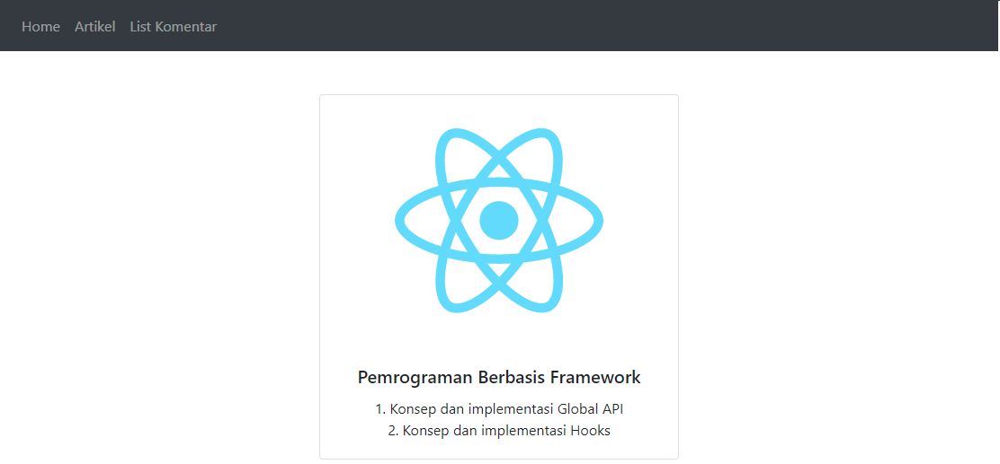
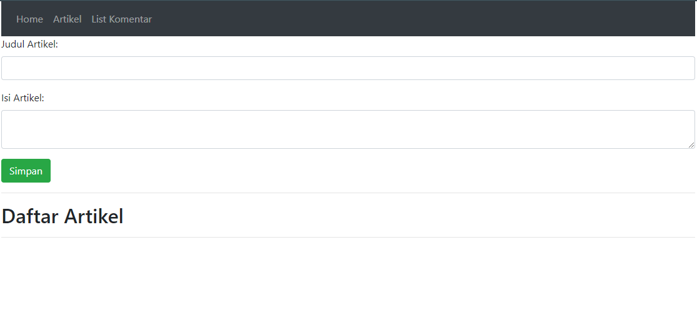
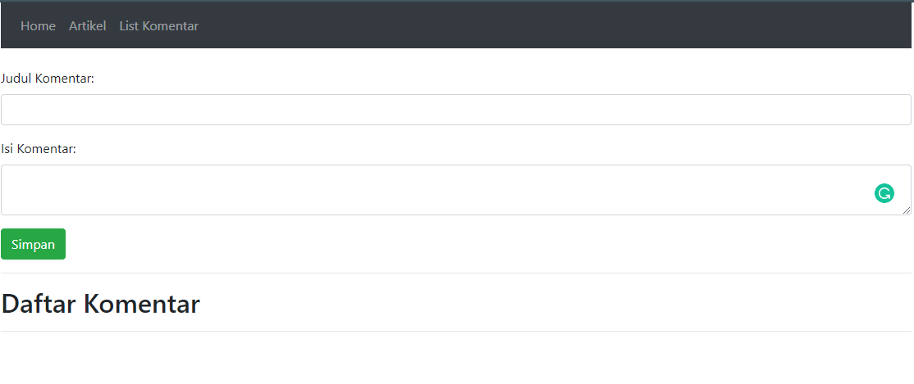
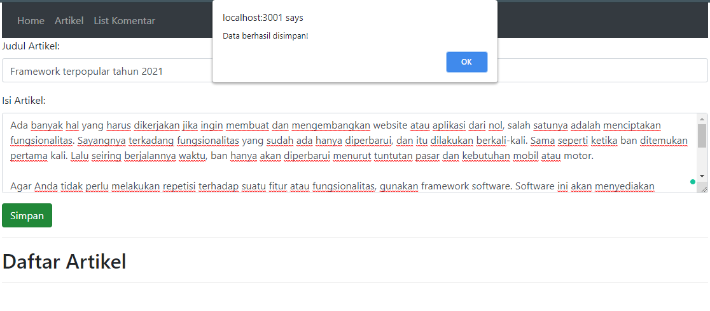
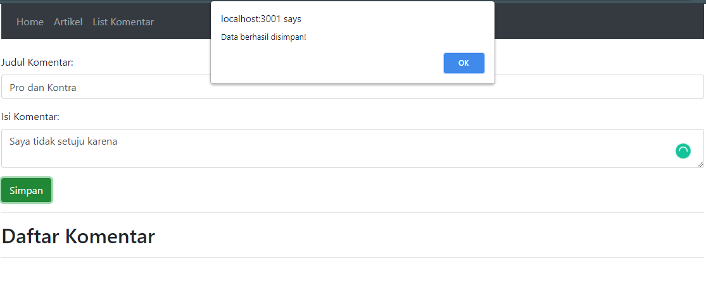

# 09 - Global API dan Hooks

## Tujuan Pembelajaran
- Konsep dan Implementasi Global API
- Konsep dan Implmentasi Hooks

## Hasil Praktikum

- Halaman Utama

- Halaman Artikel 

- Halaman Komentar

Untuk melihat kode klik tautan berikut [Link Code](../../src/09_Global_API_dan_Hooks)

## Tugas

- Hasil Tugas

- Hasil Tugas

Berikut merupakan tautan kode program [Source Code](../../src/09_Global_API_dan_Hooks)

