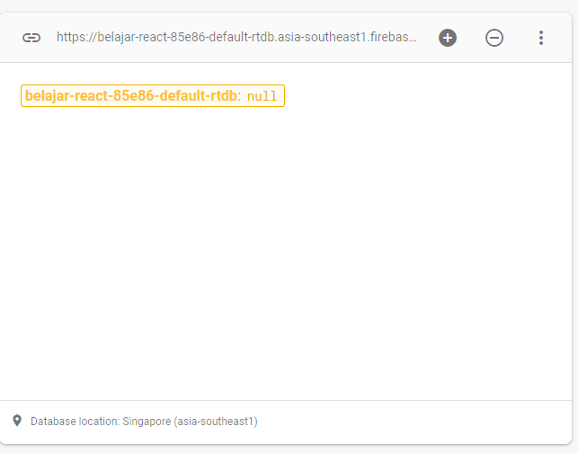
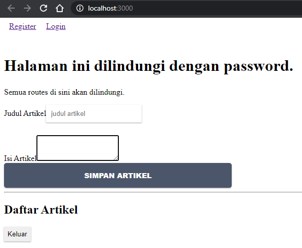
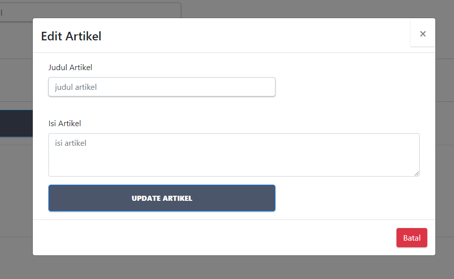

# 12 - CRUD Firebase

## Tujuan Pembelajaran

1. Mahasiswa paham dengan konsep firebase
2. Mahasiswa dapat melakukan CRUD pada firebase

## Praktikum

### Praktikum 1: Konfigurasi Database Firebase

### Praktikum 2: Membuat Fungsi Create Artikel

### Praktikum 3: Membuat Fungsi Hapus Artikel

### Praktikum 4: Membuat Fungsi Edit (Update) Artikel

Kode Program: [Disini](../../src/12_crud_firebase/firebase-app)

## Tugas

1. Berdasarkan praktikum 1 yang telah Anda lakukan, jelaskan perbedaan fungsi **locked mode** dan **test mode** pada langkah 3 saat Anda konfigurasi database Firebase?
2. Buatlah variabel `userId` pada praktikum 2 langkah 4 agar dapat menyimpan email dari user yang sedang login, sehingga dapat tersimpan di database!
3. Jelaskan maksud kode ini `(dataArtikel || [])` pada praktikum 2 langkah 6! Mengapa berbeda dari codelabs sebelumnya untuk menampilkan daftar artikel?
4. Lengkapilah kode pada praktikum 4 langkah 5 agar dapat melakukan `update artikel!` Mengapa setelah klik tombol Update Artikel, form `Modal` tidak hilang? Bagaimana Anda mengatasi hal tersebut?
5. Ketika Anda menekan tombol `Edit`, lalu menekan tombol `Batal` pada form Modal update artikel. Kemudian coba tambah artikel baru, maka artikel yang tadi kita klik tombol `Edit` akan berubah jadi data yang artikel baru ditambahkan. Mengapa demikian? Silakan diperbaiki.

## Jawab:

1. Perbedaan dari fungsi **locked mode** dan **test mode** terketaj pada penulisan dan pembacaan data, ketika masuk locked mode maka data tidak akan bisa diakses maupun diolah karena pada pengaturannya diatur false dan sebaliknya pada test mode, data bisa diakses dan diolah.

2. Yang dimaksud menghasilkan:

3. Maksud dari kode `(dataArtikel || [])` ini ialah untuk menampilkan map data dalam bentuk array ataupun objek berbeda dengan praktikum sebelumnya dimana data yang diambil hanya berbentuk objek.

4. Form `Modal` tidak hilang dikarenakan showEdit tidak diubah menjadi false.

5. Ketika menekan tombol `Edit`, lalu menekan tombol `Batal` pada form Modal update artikel kemudian ditambahkan artikel baru, maka artikel yang tadi kita klik tombol `Edit` akan berubah jadi data yang artikel baru ditambahkan semua itu karena pada onSubmit masih memanggil fungsi `handleTombolSimpan`. sehingga data baru akan tersimpan.
