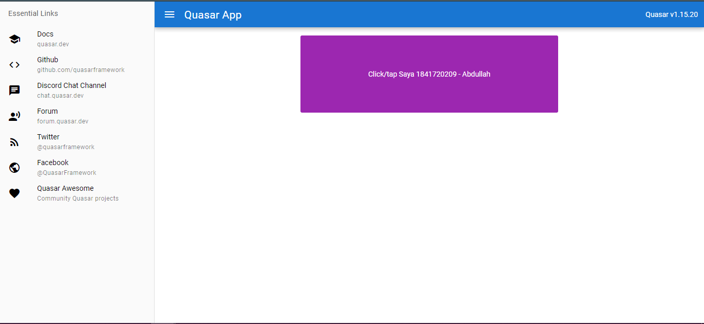
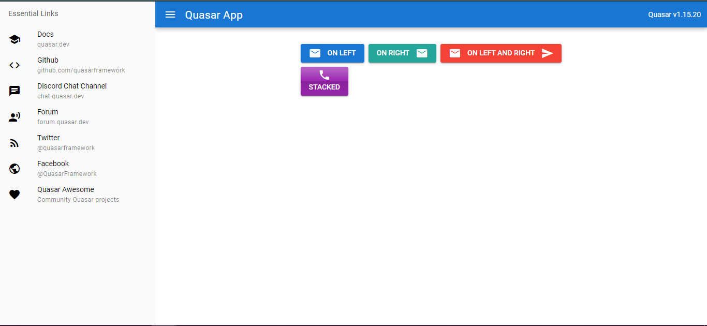
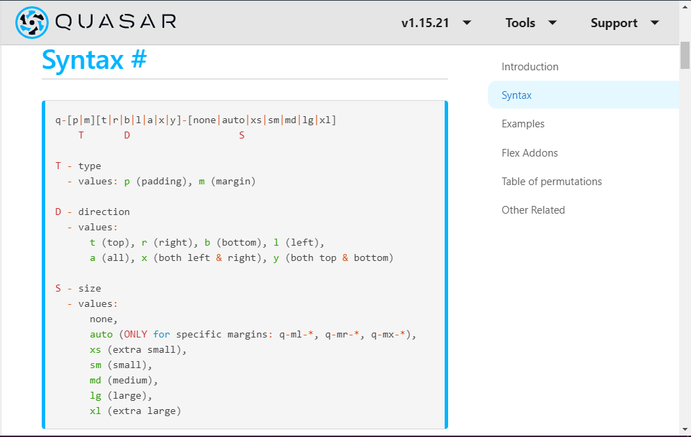
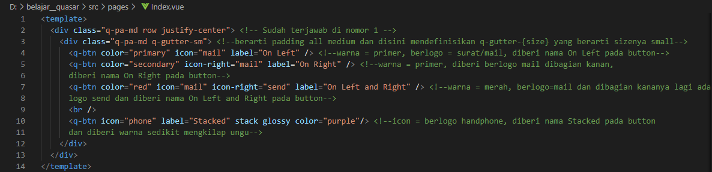

# 14 - Quasar Directives dan Components

## Tujuan Pembelajaran

- Pengenalan Quasar Directives
- Pengenalan Quasar Components

## Praktikum

[Kode Program Praktikum Bisa Klik Disini](../../src/14_Quasar_Directives_dan_Components/)

## Tugas

1. Berdasarkan praktikum 1 yang telah Anda lakukan, jelaskan maksud kode di template: `class="q-pa-md row justify-center"` ?

2. Berdasarkan praktikum 1 pada langkah nomor 4, jelaskan maksud script tersebut seperti kegunaan konstanta `colors`, fungsi `data()`, `computed`, `mounted`, dan `beforeDestroy()` !

3. Berdasarkan praktikum 2 pada langkah nomor 2, jelaskan maksud tiap kode HTML pada template yang mendefinisikan tiap button tersebut!

4. Coba ganti kode template HTML pada praktikum 2 menjadi seperti berikut. Save file, lalu perhatikan apa yang terjadi ? Mengapa terjadi demikian, jelaskan!

## Jawab:

1. Ada kelas CSS yang disediakan oleh Quasar untuk membantu mengatur jarak untuk elemen atau komponen DOM. Semua opsi diawali dengan `q-` dan kemudian dipecah menjadi type (T), direction (D), dan size (S). Yang berarti Tipe `pa` adalah `padding`, Tujuan/direksi `a` adalah `all`, dan ukurannya `md` adalah `medium` pada posisi `justify center`. Seperti yang ada pada gambar berikut

2. - `colors` digunakan untuk memberi warna pada komponen grafis. Berikut tabel penjelasannya

| Parameter | Tipe | Yang Dibutuhkan | Deskripsi |
|--|--|--|--|
| `colorName` | String | Ya | Salah satu dari `primary`, `secondary`, `accent`, `dark`, `positive`, `negative`, `info`, `warning` |
| `colorValue` | String | Ya | Nilai CSS yang valid |
| `element` | Element | - | (Default: `document.body`) Elemen tempat properti kustom akan ditetapkan |

- `data()` untuk mengambil data

- `computed` Apabila Vue di inisiasikan, properti pada `computed` aka dikonversikan menjadi properti Vue getter atau setter. Pada dasarnya dapat menganggap nilai yang dihitung sebagai nilai turunan yang akan diperbarui secara otomatis setiap kali salah satu nilai dasar yang digunakan untuk menghitungnya diperbarui dan tidak memanggil yang dihitung dan tidak menerima parameter apa pun. Bisa mereferensikan properti yang dihitung seperti halnya properti data. 

- `mounted` Sering digunakan di [lifecycle hook](https://vuejs.org/v2/guide/instance.html#Instance-Lifecycle-Hooks) pada Vue. Vue memanggil `mounted` ketika komponen ditambahkan di DOM. Ini paling sering digunakan untuk mengirim permintaan HTTP untuk mengambil data yang kemudian akan dirender oleh komponen.

- `beforeDestroy()` Siklus hidup Vue ini dipanggil tepat sebelum instance Vue dihancurkan, instance dan semua fungsi masih utuh dan berfungsi di sini. Ini adalah tahap di mana Anda dapat melakukan manajemen, menghapus variabel dan membersihkan komponen.

Berikut Lifecycle hooks pada vue

3. Seperti yang sudah kita pelajari pada nomor sebelumnya berikut penjelasannya dicomment tiap-tiap line

4. Error dikarenakan template root hanya butuh satu elemen

## Referensi

- https://quasar.dev/layout/grid/introduction-to-flexbox

- https://quasar.dev/style/spacing#syntax

- https://quasar.dev/style/color-palette

- https://quasar.dev/layout/grid/gutter

- https://vuejs.org/v2/guide/instance.html#Lifecycle-Diagram

- https://vuejs.org/v2/cookbook/avoiding-memory-leaks.html

- https://stackoverflow.com/questions/44350862/method-vs-computed-in-vue

- https://vuejs.org/v2/guide/computed.html#Computed-Properties

- https://masteringjs.io/tutorials/vue/mounted

- https://blog.logrocket.com/introduction-to-vue-lifecycle-hooks/

## Kesimpulan
Mengerti basic vue dan quasar hingga memecahkan masalah yang ada pada tugas
